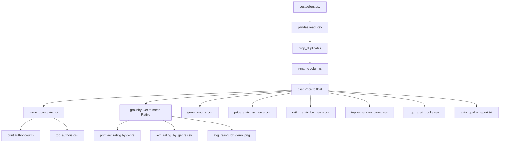

# 📊 Analyze Spreadsheet Data with Pandas

Small Pandas script that reads `bestsellers.csv`, cleans a few columns, and produces summary outputs.

## 🔎 What it does

- 📥 Loads `bestsellers.csv`
- 🧹 Drops duplicate rows
- 🏷️ Renames columns:
  - `Name` → `Title`
  - `Year` → `Publication Year`
  - `User Rating` → `Rating`
- 🔢 Ensures `Price` is numeric
- 🖨️ Prints:
  - Author counts
  - Average rating by genre
- 💾 Writes:
  - `top_authors.csv` (top 10 authors by count)
  - `avg_rating_by_genre.csv` (mean rating per genre)
  - `genre_counts.csv` (books per genre)
  - `price_stats_by_genre.csv` (min/median/mean/max price per genre)
  - `rating_stats_by_genre.csv` (count/mean/std of rating per genre)
  - `top_expensive_books.csv` (top 10 by price)
  - `top_rated_books.csv` (top 10 by rating; ties by Reviews if present)
  - `data_quality_report.txt` (rows, duplicates, missing counts, unique authors/titles, non-numeric prices)
  - `avg_rating_by_genre.png` (bar chart)

## 🧭 Flow diagram



## ▶️ Run locally (Windows)

```powershell
python -m venv .venv
.\.venv\Scripts\Activate.ps1
pip install -r requirements.txt
python main.py
```

## 📦 Outputs

After running, these files will be (re)generated in the project folder:

- `top_authors.csv`
- `avg_rating_by_genre.csv`
- `genre_counts.csv`
- `price_stats_by_genre.csv`
- `rating_stats_by_genre.csv`
- `top_expensive_books.csv`
- `top_rated_books.csv`
- `data_quality_report.txt`
- `avg_rating_by_genre.png`

## 📝 Notes

- The script overwrites the output CSVs each time it runs.
- The input `bestsellers.csv` can be sourced from common Kaggle datasets (e.g., the Amazon Top 50 Bestsellers dataset).
